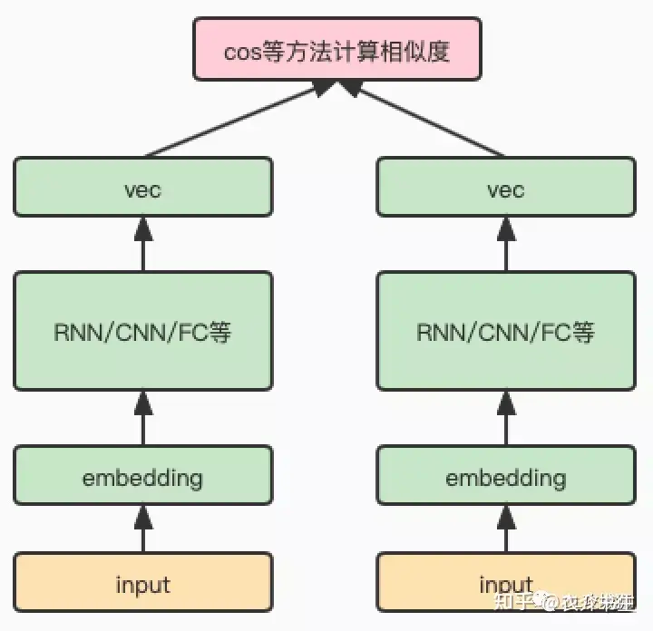
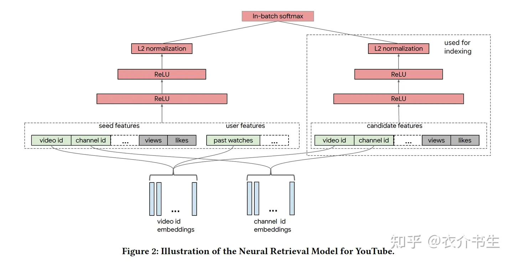

# 召回双塔模型介绍及负样本的选取艺术
As we know, 业内推荐系统一般分为召回，排序（粗排，精排），重排三个阶段，这里主要关注的是召回阶段。召回是推荐链路中的第一个漏斗，它的目的是根据用户的兴趣，将上亿➕线索池中的物品选取几千个送入粗排模块。

话说回来，召回阶段一个比较通用的方法是首先计算出用户向量和物品向量，然后通过向量计算出用户和物品的匹配度。双塔模型常被用做召回阶段的模型，在双塔模型中，一个塔用来计算用户向量，另一个塔用来计算物品向量，最后一层通过计算二者的内积等来表示用户和物品的匹配度。训练模型时通常使用用户点击过的物品作为正样本，再通过随机采样的方式抽取一些负样本。当物品数量十分巨大的时候，双塔模型很难得到充分训练。为了改进双塔模型，本文提出以下两个优化点：

1、batch softmax optimization：提升训练效率

2、streaming frequency estimation：修正sampling bias

双塔模型框架如下：

谷歌双塔模型总结：

将召回看作多分类问题，给定一个用户，通过softMax计算从
M个物品中选出合适的物品。

但上述损失函数存在的缺点就是当物品数量M非常巨大时，softmax函数计算量会非常大，常采用mini-batch的方式进行优化：

mini_batch的缺点是，因随机采样偏差使得热门物品被采样到的概率非常高，导致模型效果不好。
热门物品有更大的概率成为负样本，热门物品会被过度惩罚。

因此需要物品采样概率对损失函数进行修正。

模型训练流程：
从实时数据流中采样得到一个batch的样本

计算每个物品y被采样的概率p（streaming frequency estimation）
采用散列哈希对采样频率进行更新

计算修正后的损失函数

利用SGD更新模型参数

本文还介绍了两个小优化：

对两侧输出的embedding进行L2标准化

对于内积计算的结果，除以一个固定的超参

整体框架如下：

## 参考链接
https://zhuanlan.zhihu.com/p/574752588

https://zhuanlan.zhihu.com/p/165064102

https://zhuanlan.zhihu.com/p/464416095
