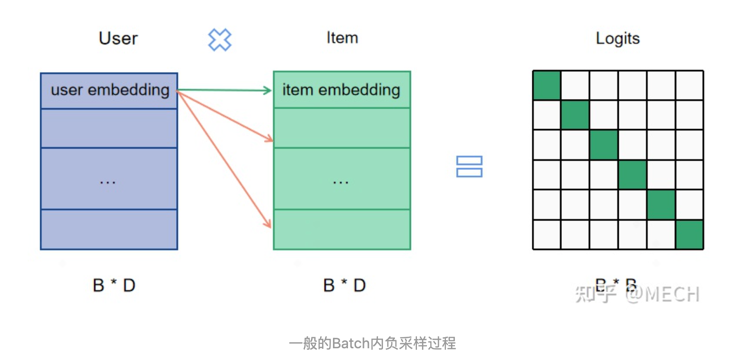

# 召回双塔模型介绍及负样本的选取艺术
As we know, 业内推荐系统一般分为召回，排序（粗排，精排），重排三个阶段，这里主要关注的是召回阶段。召回是推荐链路中的第一个漏斗，它的目的是根据用户的兴趣，将上亿➕线索池中的物品选取几千个送入粗排模块。

话说回来，召回阶段一个比较通用的方法是首先计算出用户向量和物品向量，然后通过向量计算出用户和物品的匹配度。双塔模型常被用做召回阶段的模型，在双塔模型中，一个塔用来计算用户向量，另一个塔用来计算物品向量，最后一层通过计算二者的内积等来表示用户和物品的匹配度。训练模型时通常使用用户点击过的物品作为正样本，再通过随机采样的方式抽取一些负样本。当物品数量十分巨大的时候，双塔模型很难得到充分训练。为了改进双塔模型，本文提出以下两个优化点：

1、batch softmax optimization：提升训练效率

2、streaming frequency estimation：修正sampling bias

双塔模型框架如下：

## 谷歌双塔模型总结：

将召回看作多分类问题，给定一个用户，通过softMax计算从
M个物品中选出合适的物品。

但上述损失函数存在的缺点就是当物品数量M非常巨大时，softmax函数计算量会非常大，常采用mini-batch的方式进行优化：

mini_batch的缺点是，因随机采样偏差使得热门物品被采样到的概率非常高，导致模型效果不好。
热门物品有更大的概率成为负样本，热门物品会被过度惩罚。

因此需要物品采样概率对损失函数进行修正。

### 模型训练流程：
1 从实时数据流中采样得到一个batch的样本

2 计算每个物品y被采样的概率p（streaming frequency estimation）
采用散列哈希对采样频率进行更新

3 计算修正后的损失函数

4 利用SGD更新模型参数

### 本文还介绍了两个小优化：

1 对两侧输出的embedding进行L2标准化

2 对于内积计算的结果，除以一个固定的超参

### 整体框架如下：

## 双塔模型Batch内负采样如何解决热度降权和SSB的问题

### 导语
选择负样本的时候有两个挑战：

1 任何场景一般都存在二八定律，即热门的20%的物料占据了80%的曝光，冷门的80%的物料却只占20%的曝光，因此需要在构建样本的时候对热度进行降权，减小热门样本对正样本的绑架。

2 SSB（Sample Selection Bias）问题，样本选择偏差，简单来说就是样本范围必须得和模型使用的场景一致，否则模型会无法区分一些没怎么见过的样本。

一般而言，粗排和召回中负样本采样方法是全局随机负采样，对于每一个user，
可以从全局候选物料里面随机抽取非正例的item做为负例，这种方法可以针对不同热度的物料提前采样负样本，
因此可以事先完成热度降权，并且由于样本空间是全库的，因此极大地缓解了SSB问题。

业界另一种常用方法是batch内负采样，即输入数据只有用户点击物品的正样本，
在一个batch里面随机采样一定比例的除本item外其它的item作为user的负样本，
这种方式的优点就是占用资源少，样本pipline简单。
但是工程上batch内负采样一般是不会进行热度降权采样的。

因此工业界一般都是除正样本外其他的所有item都当做负样本，
既然不方便在训练的时候从外部直接影响batch内的采样过程，那这里就引入了本文题目所指的两个核心问题：

1 假如冷门item都没被任何user点击过，那么冷门item直接失去了成为负样本的可能，
item缺失这就引入了SSB问题。另一种情况是，冷门item在所有空间内被点击了非常少的次数，
比如说就被点击了一次，那么一但该冷门item被划分在了某个batch内，
那么其他batch就直接丧失了让其成为负样本的可能性，即不是每个user都可以有冷门样本作为负样本的概率，
这也引入了SSB问题。

2 假如热门情况很严重，前面提到的天然缓解效应不够，还是需要**额外的热度降权**该怎么办？

本文为解决在Batch内负采样的时候会遇到的上述问题给出了解决方案，
只用一招：即在构建样本的时候加入额外的负样本，如果想解决热度降权的问题，可以多加入热门item负样本，
如果想解决冷门样本很难成为有些user负样本的SSB问题，
可以再加入针对user采样的冷门负样本，具体原理和代码展示请继续往下看。

### 热门降权的基本原则

首先热度降权的基本原则是：

1 当热门物料做正样本时，要降采样，减少对正样本集的绑架。

2 当热门物料做负样本时，要适当过采样，抵销热门物料对正样本集的绑架。

3 对于冷门物料，虽然成为负样本的概率比较小，但也要保证冷门样本能成为负样本的可能性，否则会带来SSB问题。

4 注意：第一条第二条不一定都做，视情况和易用性来做。甚至是否需要热门打压都需要先考虑清楚，虽然热门效应带来了偏差但是并不一定是坏事。

显然，对于batch内负采样，第一条是可以轻易做到的，因为我们可以直接对正样本采样。不过一般对于batch内负采样来说，正样本工程上不做热门降采样，因为采样后同时会降低热门样本作为负样本的概率，而热门负样本一般来说大概率是困难负样本（hard-negtive），对于召回模型的效果打击较大。

构建样本的时候加入额外的负样本，也就是说batch内负采样的时候样本不仅仅是正样本也包含了按照规则采样的负样本。

正常的batch负采样方法一般如图所示：

加入额外负样本的采样方法：

## 负样本为王

## 参考链接
https://zhuanlan.zhihu.com/p/574752588

https://zhuanlan.zhihu.com/p/165064102

https://zhuanlan.zhihu.com/p/464416095
